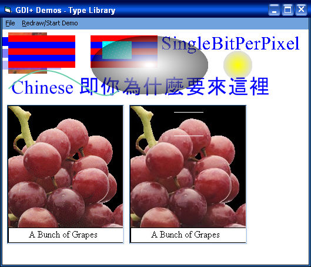



## GDI\+ Demos using TLB

### Description

GDI+ TLB v1.05. Special thanks to Vlad Vissoultchev for new Demos and wrappers. Demos(by Avery) tweaked to run with this TLB. Several bugs fixed in TLB and a few additions. If you don't have XP or Win2k SP3 then you must install GDI+(free from Microsoft) at http://www.microsoft.com/downloads/release.asp?releaseid=32738.
 
### More Info
 

             |
---                |---
**Submitted On**   |2003-02-07 00:12:00
**By**             |[Dana Seaman\_](https://github.com/Planet-Source-Code/PSCIndex/blob/master/ByAuthor/dana-seaman.md)
**Level**          |Intermediate
**User Rating**    |4.8 (43 globes from 9 users)
**Compatibility**  |VB 6\.0
**Category**       |[Graphics](https://github.com/Planet-Source-Code/PSCIndex/blob/master/ByCategory/graphics__1-46.md)
**World**          |[Visual Basic](https://github.com/Planet-Source-Code/PSCIndex/blob/master/ByWorld/visual-basic.md)
**Archive File**   |[GDI\+\_Demos154036262003\.zip](https://github.com/Planet-Source-Code/dana-seaman-gdi-demos-using-tlb__1-43004/archive/master.zip)

### API Declarations

Embedded in TLB

